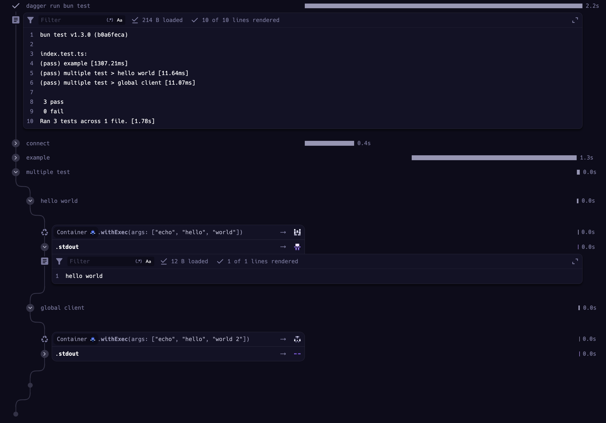

# Bun OTEL Test library

A wrapper around `bun-test` to automatically traces tests inside `dagger run` or `dagger call`.

### Installation

```shell
bun install @otel-test-runner/bun-test
```

### Usage

Simply replace your original `bun:test` import with that library.

```ts
import { test, describe } from "@otel-test-runner/bun-test";
```

### Dagger integration

You can automatically view your traces on Dagger Cloud with that library.


